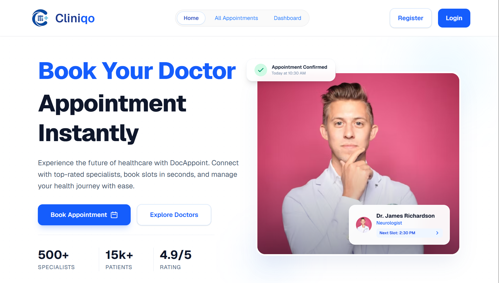

# DocAppoint (Cliniqo)

**Book Your Doctor Appointment Instantly**

A modern, full-featured doctor appointment booking platform built with **Next.js 16** and **TypeScript**. Connect patients with top-rated specialists, book appointments in seconds, and manage your healthcare journey seamlessly.



[Live Site →](https://doc-appoint-client-pi.vercel.app/)

---

## ✨ Features

- **Instant Appointment Booking** — Search and book doctors by specialty, availability, or symptoms
- **Smart Doctor Directory** — Browse verified specialists with ratings, experience, and availability
- **Advanced Search & Filters** — Filter by specialty, location, experience, ratings, and availability
- **User Authentication** — Secure login and registration using **Better Auth**
- **Patient Dashboard** — Manage upcoming and past appointments
- **Real-time Availability** — Check live slots and get instant booking confirmation
- **Responsive Design** — Beautiful, clean UI optimized for desktop and mobile
- **Modern Animations** — Smooth interactions powered by Framer Motion and Lenis

---

## 🛠️ Tech Stack

| Technology       | Version    | Purpose                   |
|------------------|------------|---------------------------|
| **Next.js**      | 16.2.6     | React Framework           |
| **TypeScript**   | ^5         | Type Safety               |
| **Tailwind CSS** | ^4         | Styling                   |
| **Better Auth**  | ^1.6.11    | Authentication & Sessions |
| **MongoDB**      | ^7.2.0     | Database                  |
| **Lucide React** | ^1.16.0    | Icons                     |
| **Swiper**       | ^12.1.4    | Carousels                 |
| **Motion**       | ^12.40.0   | Animations                |
| **Lenis**        | ^1.3.23    | Smooth Scrolling          |

---

## 🚀 Getting Started

### Prerequisites

- Node.js 18+
- MongoDB (local or MongoDB Atlas)

### Installation

1. **Clone the repository**
   ```bash
   git clone https://github.com/Rakib-dhali/DocAppoint.git
   cd DocAppoint
   ```

2. **Install dependencies**
   ```bash
   npm install
   ```

3. **Set up environment variables**

   Create a `.env.local` file in the root directory:
   ```env
   MONGODB_URI=your_mongodb_connection_string
   BETTER_AUTH_SECRET=your_secret_key
   BETTER_AUTH_URL=http://localhost:3000
   ```

4. **Run the development server**
   ```bash
   npm run dev
   ```

5. Open [http://localhost:3000](http://localhost:3000) to view the application.

---

## 📁 Project Structure

```
src/
├── app/                    # Next.js App Router
│   ├── dashboard/          # Patient dashboard
│   ├── login/              # Authentication pages
│   ├── register/
│   ├── all-appointments/
│   └── api/                # API routes
├── components/             # Reusable UI components
├── lib/                    # Utilities and configurations
└── proxy.ts                # Authentication proxy middleware
```

---

## 🧩 Key Features Implemented

- Full authentication system (Better Auth + MongoDB adapter)
- Protected dashboard routes
- Appointment booking, viewing, updating, and cancellation
- Responsive doctor listing and search
- Modern UI with smooth animations

---

## 📸 Screenshots

> Coming soon

---

## 🤝 Contributing

Contributions are welcome! Feel free to open issues or submit pull requests.

1. Fork the project
2. Create your feature branch
   ```bash
   git checkout -b feature/amazing-feature
   ```
3. Commit your changes
   ```bash
   git commit -m 'Add some amazing feature'
   ```
4. Push to the branch
   ```bash
   git push origin feature/amazing-feature
   ```
5. Open a Pull Request

---

## 📄 License

This project is open source and available under the [MIT License](LICENSE).

---

## 👨‍💻 Author

**Rakibul Hossain**

[](https://github.com/Rakib-dhali)
---

⭐ If you like this project, please give it a star!